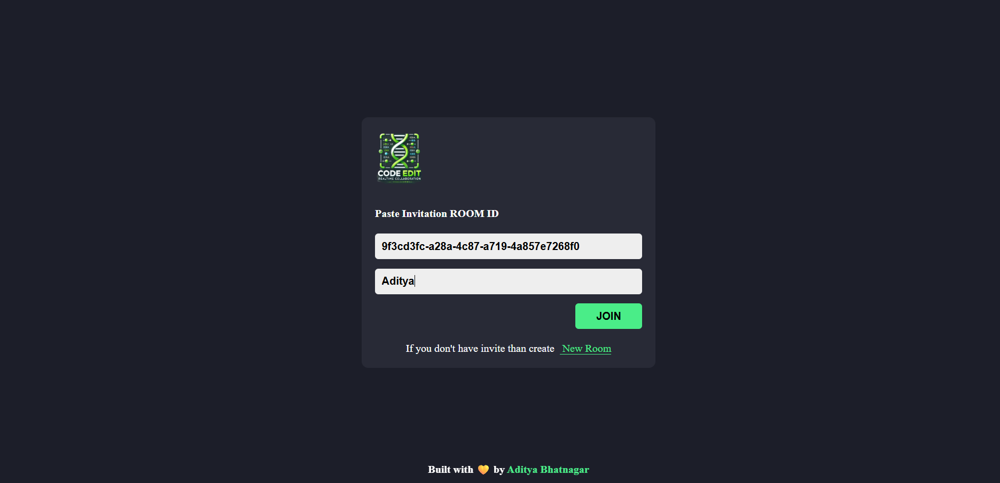
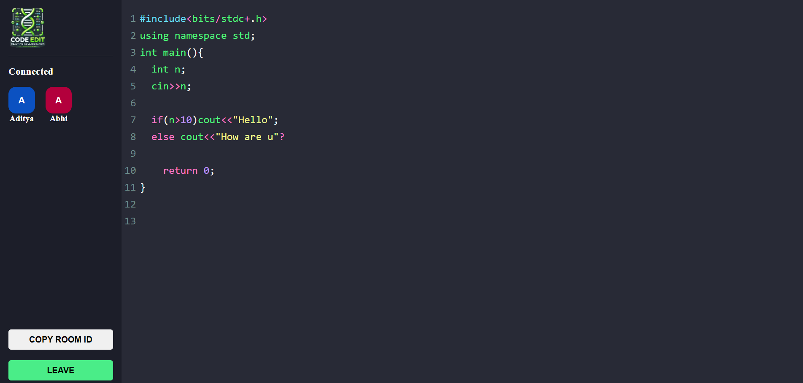

# 🧬 Real-Time Code Editor

A collaborative code editor that enables multiple users to edit code simultaneously in real-time. Built using **React**, **Express.js**, **Socket.io**, **UUID**, and optionally **Leaflet.js**, it supports multiple users in a single room with live code sharing and connection tracking.

---

## 📸 Screenshots


|  |  |


---

## 📂 Project Structure

```
Realtime-code-editor/
├── node_modules/
├── public/
├── src/
│   ├── assets/
│   ├── pages/
│   ├── App.css
│   ├── App.jsx
│   ├── index.css
│   ├── main.jsx
│   └── socket.js
├── .env
├── .gitignore
├── eslint.config.js
├── index.html
├── package-lock.json
├── package.json
├── README.md
├── server.js
└── vite.config.js
```

---

## ✨ Features

- 🔗 **Real-time collaboration** with multiple users
- 🧠 **WebSocket communication** via Socket.io
- 🧾 **Room-based sessions** using unique UUIDs
- 🪄 **Live code sync** for all participants
- 🧍‍♂️ **User connection display**
- 🧭 (Optional) **Leaflet.js integration** for geo-based features or UI

---

## ⚙️ Installation

### 1. Clone the Repository

```bash
git clone https://github.com/your-username/realtime-code-editor.git
cd realtime-code-editor
```

### 2. Install Dependencies

```bash
npm install
```

### 3. Setup Environment Variables

Create a `.env` file in the root and add necessary environment configs:

```env
PORT=3000
VITE_BACKEND_URL=http://localhost:3000
```

### 4. Start the Development Server

Run backend and frontend concurrently (or in separate terminals):

```bash
# Start the backend server
node server.js
```

```bash
# Start Vite dev server
npm run dev
```

---

## 🚀 Usage

1. Run the app and open it in your browser.
2. Click **"Create Room"** or enter an existing **Room ID**.
3. Start coding collaboratively!
4. See connected users on the sidebar.

---

## 🛠️ Tech Stack

- **Frontend**: React, Vite
- **Backend**: Node.js, Express
- **WebSockets**: Socket.io
- **Unique Room ID**: UUID
- **Optional**: Leaflet.js for location features


---

## 👨‍💻 Authors

- **Aditya**


